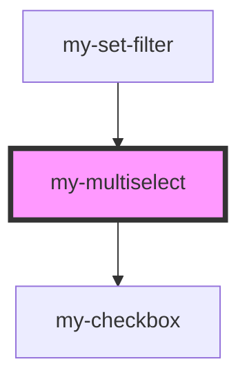

# multiselect

<!-- Auto Generated Below -->

## Properties

| Property       | Attribute        | Description | Type              | Default           |
| -------------- | ---------------- | ----------- | ----------------- | ----------------- |
| `batchSize`    | `batch-size`     |             | `number`          | `50`              |
| `disabled`     | `disabled`       |             | `boolean`         | `false`           |
| `error`        | `error`          |             | `boolean`         | `false`           |
| `errorMessage` | `error-message`  |             | `string`          | `"Error"`         |
| `label`        | `label`          |             | `string`          | `""`              |
| `maxItemCount` | `max-item-count` |             | `number`          | `undefined`       |
| `options`      | `options`        |             | `any[] \| string` | `undefined`       |
| `placeholder`  | `placeholder`    |             | `string`          | `""`              |
| `size`         | `size`           |             | `string`          | `'medium (40px)'` |

## Events

| Event               | Description | Type               |
| ------------------- | ----------- | ------------------ |
| `multiselectIsOpen` |             | `CustomEvent<any>` |
| `mySelect`          |             | `CustomEvent<any>` |

## Dependencies

### Used by

 - [my-set-filter](../../set-filter)

### Depends on

- [my-checkbox](../../checkbox)

### Graph

----------------------------------------------

*Built with [StencilJS](https://stenciljs.com/)*
